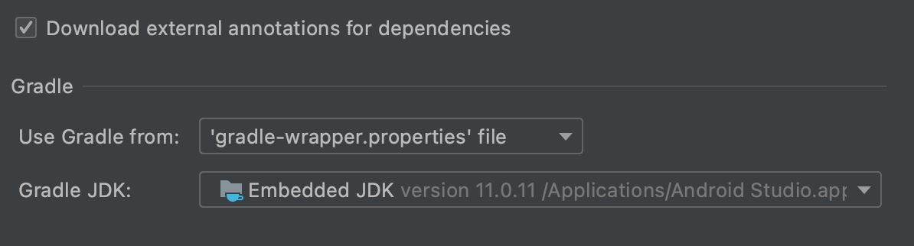

## 参考文章

升级AndroidStudio的版本到2021.1.1 Patch 3后，出现了Android Gradle plugin requires Java 11 to run. You are currently using Java 1.8错误

本地配置的Java版本是1.8，但由于有些项目还是用Java 1.8编译，不能直接升级Java版本。同时又有项目是需要用新版本AGP的，唯有针对这个项目进行单独配置。

打开Preferences->Build,Execution..->BuildTools -> Gradle，将java改为Android Studio内置的版本

即可顺利编译新项目
