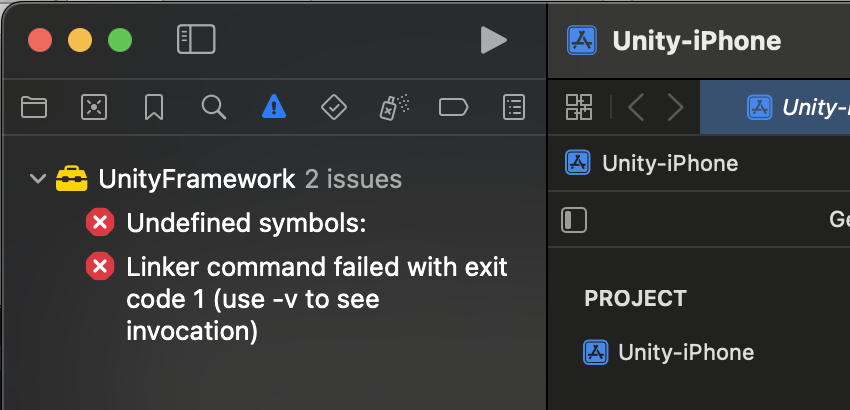
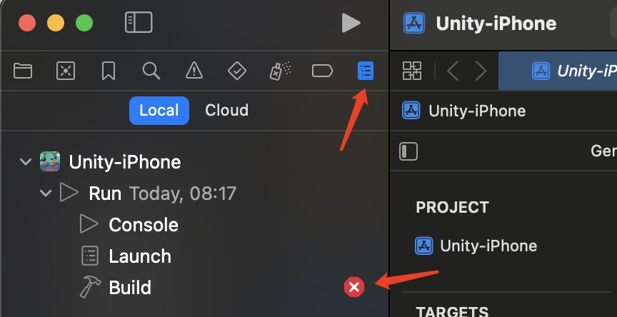
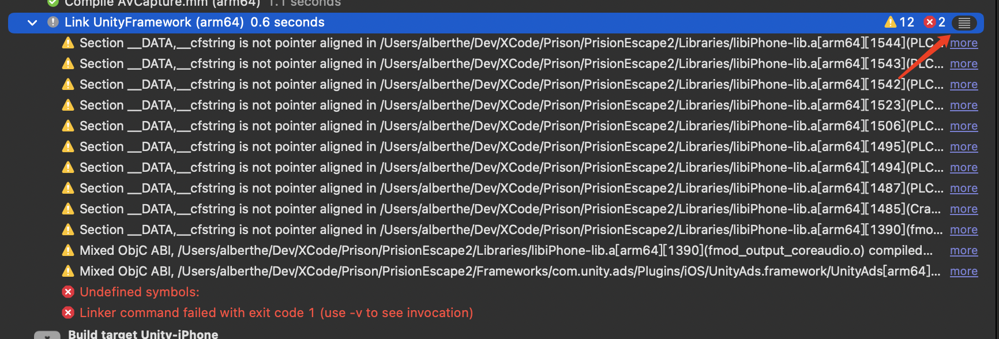

## XCode如何查看详细报错信息

从Unity导出工程到XCode打开后，编译失败了，但是点击错误按钮又不会显示详细的错误信息，可按下面的教程来查看详细错误信息。

首先，点击错误按钮后，左边栏显示是这样的

错误信息非常简单，只有Undefined symbols，但具体是哪个symbol出错，完全没信息。

实际上，XCode的查看错误详细信息，要点击下图中的按钮，才跳转到详细的编译信息（竟然不会自然跳转，有点low）。

但打开后，除了多一堆warning的错误，好像也没差别。不急，要再展开看更详细的要点击箭头这里。

这下好，打开后就能看到详细的出错信息，终于看到是因为_sampleMethod和_sampleTextMethod没找到对应的链接库，这下可以通过链接库，或去掉无效方法来解决~
