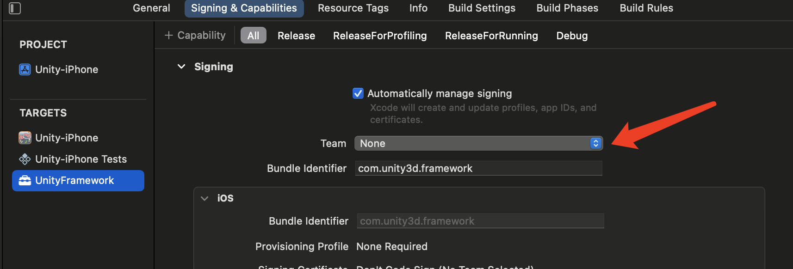
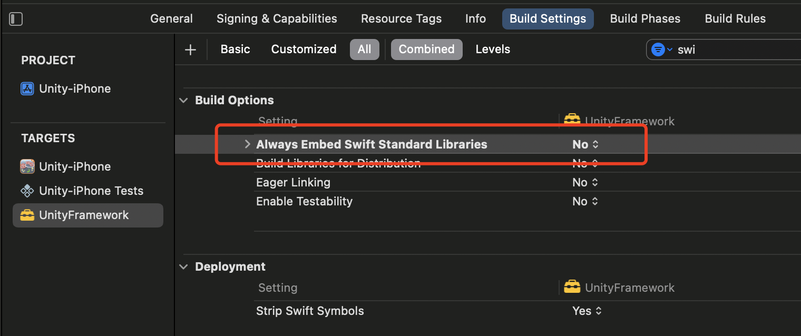

## 记一次Unity2020导出工程XCode上传错误处理

> 今天，有一款游戏从Unity 2020中导出XCode工程，并执行Archive准备上传AppStore时遇到了以下错误。

第一次，提示UnityFramework.framework没有签名，详细错误信息如下

> Missing signing identifier at "/var/folders/j2/xkf3j34543x6xqdtk54dfyqw0000gn/T/XcodeDistPipeline.~~~d8uEOI/Root/Payload/XXXX.app/Frameworks/UnityFramework.framework/Frameworks/libswiftCore.dylib".

Google上一搜，有的人说要设置Target minimum iOS version到15，有的人说要移除AVFoundation.framework。我试了下第二种方法，并不起作用，又不想升级min version到这么高。最后发现，UnityFramework.framework这里没有选择签名，终于设置了自动签名后没再报这个错误。

再次上传提交，出现了另外一个错误。

> Invalid Bundle. The bundle at UnityFramework.framework contains disallowed file 'Frameworks'

这个错误看起来更抽象，但应该是些设置项不对，最后发现，可通过修改这个来规避：将Always Embed Swift Standard Libraries设置为NO，如下图所示

AppStore发布一次真不容易，各种莫名奇妙的问题会出现。

